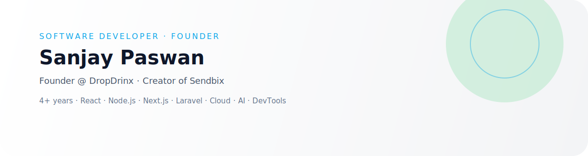

<!--
**paswans05/paswans05** is a ✨ _special_ ✨ repository because its `README.md` (this file) appears on your GitHub profile.

Here are some ideas to get you started:

- 🔭 I’m currently working on ...
- 🌱 I’m currently learning ...
- 👯 I’m looking to collaborate on ...
- 🤔 I’m looking for help with ...
- 💬 Ask me about ...
- 📫 How to reach me: ...
- 😄 Pronouns: ...
- ⚡ Fun fact: ...
-->
<!-- Auto Light/Dark Mode Banner -->
<p align="center">
  <picture>
    <source media="(prefers-color-scheme: dark)" srcset="./sanjay-banner-dark.svg">
    <source media="(prefers-color-scheme: light)" srcset="./sanjay-banner.svg">
    
  </picture>
</p>

# 🌟 **Sanjay Paswan — Software Developer & Founder**

## 👋 Hi, I'm Sanjay  
> Founder @ **DropDrinx** · Building **Sendbix**, AI tools & developer utilities  

I’m a **full-stack developer** with 4+ years of experience building scalable software, developer tools, and automation systems.

---

# 🚀 About Me  
- JavaScript-first full-stack developer  
- Skilled in **React**, **Next.js**, **Node.js**, **Laravel**, **Flutter**, **DevOps**  
- Creator of VS Code extension **CommiX**  
- Author of npm package **currency-in-word**  
- Founder of **BazarTap**, **DropDrinx**, **Sendbix**  
- Passionate about **AI**, **automation**, **startup building**, and **developer experience**  

---

# 🧩 Open Source Projects  

## 🚀 **CommiX – AI Commit Generator (VS Code Extension)**  
Generate commit messages instantly using AI.

### ✨ Features  
- AI-generated commit messages  
- Supports Simple, Detailed, and Conventional Commit formats  
- Understands Git diffs  
- Speeds up developer workflow  

### Usage  


### Links  
| Type | URL |
|------|-----|
| VS Marketplace | *https://marketplace.visualstudio.com/items?itemName=paswans05.commix* |
| GitHub Repo | *(https://github.com/paswans05/commix.git)* |

---

## 🔢 **currency-in-word – NPM Package**

Convert numbers or currency into English words (supports Indian & International systems).

### NPM  
https://www.npmjs.com/package/currency-in-word

### Install  
```bash
npm install currency-in-word
```

## 🛠 Tech I Use

**Frontend**
- React · Next.js · Tailwind CSS · Flutter · JavaScript · TypeScript

**Backend**
- Node.js · Express · Laravel · PHP · REST APIs · Redis · Prisma

**Databases**
- MySQL · PostgreSQL · MongoDB · Firebase

**DevOps & Infra**
- Docker · GCP · AWS · Nginx · Cloudflare · GitHub Actions

---

## 🚀 Current Focus

- 🛍 **BazarTap** – hyperlocal delivery & store ecosystem  
- 🍻 **DropDrinx** – global-first responsible alcohol delivery  
- ✉️ **Sendbix** – email + WhatsApp marketing & automation  
- 🤖 AI API aggregator & dev tools  
- 📱 Mobile IDE concept powered by AI  

---

## 📊 GitHub Overview

<p align="left">
  
  
</p>

---

## 🏆 Trophies


---

## 🐍 Contribution Graph


---

## 🌐 Find Me Online

- 💼 [LinkedIn](https://linkedin.com/in/paswans05)
- 🐦 [X (Twitter)](https://x.com/paswans05)
- 📧 **Email:** `paswans05@gmail.com`

---

> _“Build fast. Learn faster. Ship always.”_ 🚀
